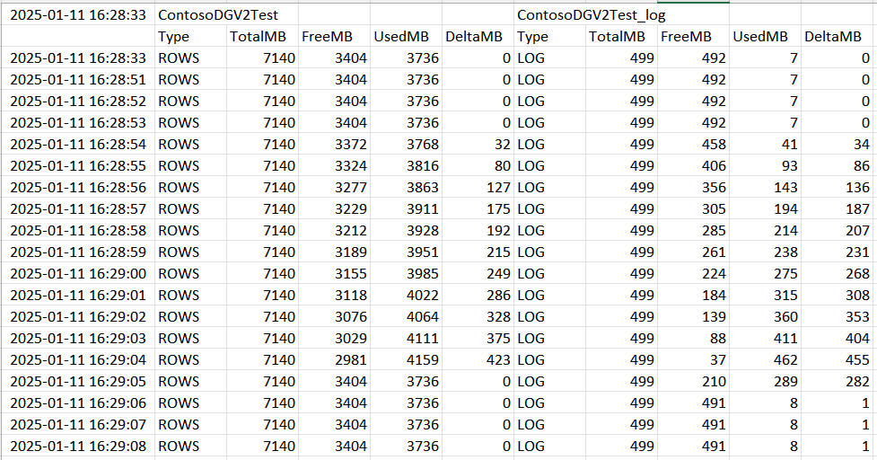

# SqlServerTraceSize

It extracts information about MDF and LDF usage of a SQL Server database: total size, used, free and delta from start. Useful information to analyze MDF/LDF usage during stressful activity like index rebuild, creating, data import, etc. It output data to an excel file.

[JUST A DEMO - WORK IN PROGRESS]

Example: space used during an index rebuild

